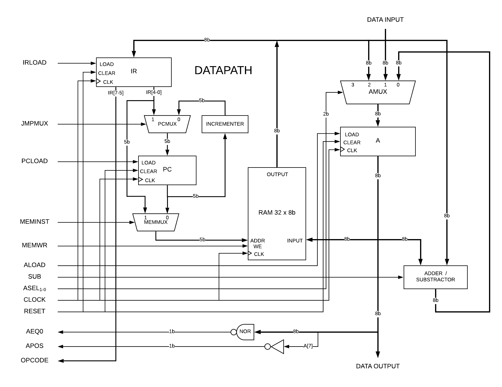
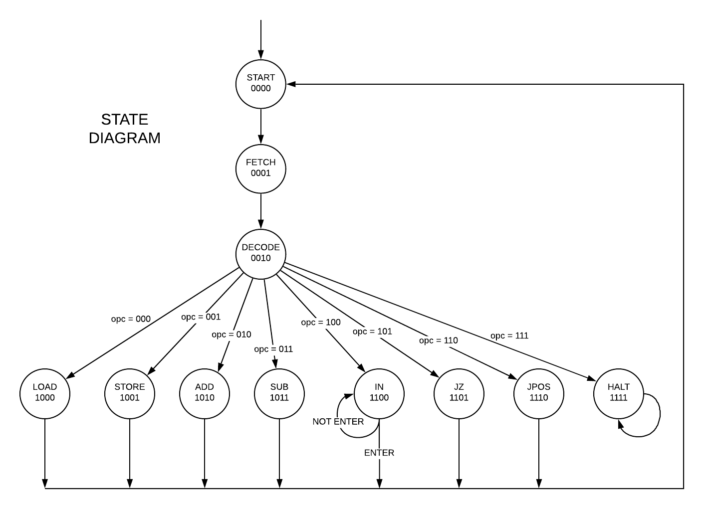
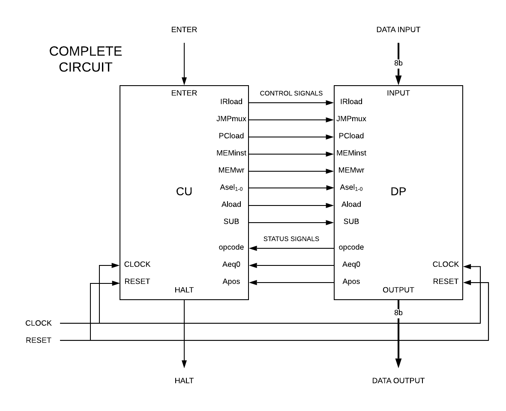

# EC2-Computer

Implementation of "Enoch" Computer version 2, designed by Enoch O. Hwang, in his book _Digital Logic and Microprocessor Design with VHDL_, 2005.

The computer follows the Von Neumann approach, based on an 8b microprocessor with internal data+instruction RAM memory, including input/output ports.

## Instruction set

The instruction set is composed on eight different instructions:

|   Instruction    |    Encoding    |      Operation       |                       Comment                            |
|------------------|----------------|----------------------|----------------------------------------------------------|
| LOAD A, address  |    000aaaaa    |    A <= Mem[aaaaa]   |  Load to A the memory data specified by address.         |
| STORE A, address |    001aaaaa    |    Mem[aaaaa] <= A   |  Store A content to memory location specified by address |
|  ADD A, address  |    010aaaaa    |  A <= A + Mem[aaaaa] |  Add A content with memory data and stores in A          |
|  SUB A, address  |    011aaaaa    |  A <= A - Mem[aaaaa] |  Substract A content with memory data and stores in A    |
|       IN A       |    100-----    |      A <= input      |  Store the input data into A                             |
|   JZ address     |    101aaaaa    | if (A=0) PC <= aaaaa |  Jump to memory location if A content is zero            |
|  JPOS address    |    110aaaaa    | if (A>0) PC <= aaaaa |  Jump to memory location if A content is positive        |
|       HALT       |    111-----    |         HALT         |  Halts the execution of the program.                     |

 where 
 + A : 8b accumulator register.
 + Mem : internal 32x8b RAM memory.
 + aaaaa : 5 bit address to point one of the memory slots.
 + ----- : not defined nor used bits
 
 ## Datapath
 
The datapath or process unit is designed based on the instruction set, because it has to perform all the functional and arithmetic operations, which are specified by the instructions. The **components** will be:

1. **A** (8b) : Accumulator register. Stores the result of arithmetic operation.
2. **RAM memory** (32x8b) : internal memory with synchronous read and write operations. 
3. **IR** (8b) : Instruction Register, stores the current instruction fetched from memory.
4. **PC** (5b) : Program Counter. Contains the next instruction address.
5. **Incrementer** (5b) : Used to increment PC's content.
6. **Adder/Substractor** (8b) : performs addition and substraction.
7. **PCmux** (5b) : 2-1 multiplexor which selects the next PC address.
8. **MEMmux** (5b) : 2-1 multiplexor to select the next memory address.
9. **Amux** (8b) : 4-1 multiplexor to select the next accumulator content.

The datapath has to perform the following **operations**, classified on their purpose:

1. _Instruction cycle_: 
 + Loads the instruction from memory to IR. Increments PC's content by one and load it back to PC. 
 + Distinguish between memory fecthing address (to fecth the next instruction) and memory operand address (to point some memory data).

2. _Memory cycle_: 
 + Reads the memory data/instruction specified by memory address and loads it to A/IR.
 + Writes A's content to the memory location specified by memory address.
 
3. _Execution cycle_:
 + Adds or substracts to A's content the memory output data, and loads the result back to A.
 + Loads the external data input to A.
 + Loads the operand address specified by jump instruction on PC.
 
The datapath also has to provide the next **status signals** to CU:

+ **Aeq0** (1b) : Tells to CU whether A content is zero. Implemented on A output with an 8b NOR gate.
+ **Apos** (1b) : Tells to CU whether A content is positive. Implemented by negating the most significant bit of A output.
+ **Opcode** (3b) : The three most significant bits of IR output, tells to CU which instruction to execute.
 
From the components and functionallity, we will need up to 8 **control signals** from CU, which are:

1. **IRload** (1b) : IR load enable signal.
2. **JMPmux** (1b) : PCMux selection signal.
3. **PCload** (1b) : PC load enable signal.
4. **MEMinst** (1b) : MemMux selection signal.
5. **MEMwr** (1b) : memory write enable signal.
6. **Asel** (2b) : Amux selection signals.
7. **Aload** (1b) : A load enable signal.
8. **Sub** (1b) : Substraction enable signal.

So here's the Datapath design, which best describes the conections between it's components:

 ## Control Unit
 
 State diagram:
 
 
 
 Next state table:

| Current state[Q3, Q2, Q1, Q0]|000(LOAD)|001(STORE)|010(ADD)|011(SUB)|100(IN)|101(JZ)|110(JPOS)|111(HALT)|Enter=0| Enter=1|
|------------------------------|---------|----------|--------|--------|-------|-------|---------|---------|-------|--------|
|          0000 (start)        | 0001    | 0001     | 0001   | 0001   | 0001  | 0001  | 0001    | 0001    |       |        |
|          0001 (fetch)        | 0010    | 0010     | 0010   | 0010   | 0010  | 0010  | 0010    | 0010    |       |        |
|          0010 (decode)       | 1000    | 1001     | 1010   | 1011   | 1100  | 1101  | 1110    | 1111    |       |        |
|          1000 (load)         | 0000    | 0000     | 0000   | 0000   | 0000  | 0000  | 0000    | 0000    |       |        |
|          1001 (store)        | 0000    | 0000     | 0000   | 0000   | 0000  | 0000  | 0000    | 0000    |       |        |
|          1010 (add)          | 0000    | 0000     | 0000   | 0000   | 0000  | 0000  | 0000    | 0000    |       |        |
|          1011 (sub)          | 0000    | 0000     | 0000   | 0000   | 0000  | 0000  | 0000    | 0000    |       |        |
|          1100 (in)           |         |          |        |        |       |       |         |         | 1100  | 0000   |
|          1101 (jz)           | 0000    | 0000     | 0000   | 0000   | 0000  | 0000  | 0000    | 0000    |       |        |
|          1110 (jpos)         | 0000    | 0000     | 0000   | 0000   | 0000  | 0000  | 0000    | 0000    |       |        |
|          1111 (halt)         | 1111    | 1111     | 1111   | 1111   | 1111  | 1111  | 1111    | 1111    |       |        |

 ## Implementation
 
 Complete circuit:
 
 
 
 ## Execution and testbench
 
